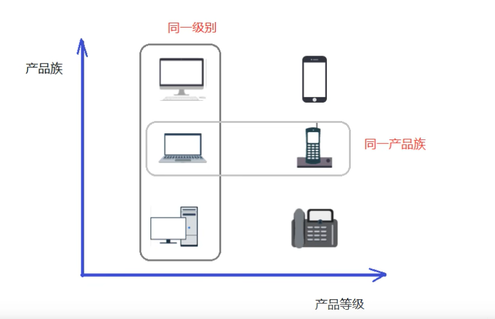

# 工厂模式
  ### 需求1.0
  - 需求: 设计一个咖啡店点餐系统;
  - 计划: 设计一个咖啡类(Coffee),并定义其两个子类(美式咖啡AmericanCoffee和拿铁咖啡LatteCoffee);再设计一个咖啡店类CoffeeStore,咖啡店具有点咖啡的功能;

  ## 最初版代码实现,仅实现功能
  - [代码实现,采用了简单工厂模式中的静态工厂](/src/main/java/com/kul/factory/original)
  - 可以看到最初版的一个问题在于,如果我们要增加新的品类,那么一个新的咖啡类肯定是必不可少的,但我们还需要去改咖啡店的代码,这个耦合度太高了;相当于是加盟店不可能每
  个店去给你定义逻辑,去帮你设计产品;一定是通过提供机器和原料的方式,咖啡店只是个加盟商,核心技术都应该在我们这;如果使用简单工厂模式,相当于我们只需要把工厂信息给
  咖啡店,咖啡店不需要了解我们的逻辑,也不需要在我们上新品的时候进行逻辑调整,咖啡店始终都是只通过我们的工厂类产生咖啡,这种方式显然是更好的,这就是简单工厂模式;

  ## 简单工厂模式
  - 理解: 将简单工厂模式想成加盟商加盟的案例会比较好理解,我花钱加盟,那我的产品怎么来,是用厂家提供的原材料直接在厂家指定的机器上加工,我不需要知道这个原材料是如何生产的,
  我只是一个加工的中间商,厂家有什么变化,给我的原材料自然就变化了,我也不需要去考虑原材料是如何创建的,有什么成分,给我啥就用啥,反正都是在一个机器上进行加工加工;
  - 概念: 总结来说,简单工厂模式的核心是通过一个工厂类来创建对象实例,而不是对象自己创建自己;至于是否采取静态工厂或普通工厂,则要根据实际情况决定,静态只是一种方便的实现方式,
  并不是必须的;
  - 代码: 

  ### 简单工厂模式的优缺点
  - 优点: 封装了创建对象的过程,可以通过参数直接获取对象;把对象的创建和业务逻辑分开,这样以后就避免了修改客户代码,如果要实现新产品,直接修改工厂类,而不需要再客户代码侧进行
        修改,降低了耦合,更容易拓展
  - 缺点: 增加新产品时还是需要修改工厂类,违背了开闭原则;

  ## 工厂方法模式
  - 工厂方法模式解决了简单工厂模式违背了开闭原则的这一问题,通过定义一个用于创建对象的接口,让子类决定实例化哪个产品类对象;工厂方法将一个产品类的实例化延迟到了其工厂的子类;

  ### 工厂方法模式的主要角色
  - 抽象工厂: 提供了创建产品的接口,调用者通过它访问具体工厂的工厂方法来创建产品
  - 具体工厂: 主要是实现抽象工厂中的抽象方法,完成具体产品的创建
  - 抽象产品: 定义了产品的规范,描述了产品的主要特性和功能;
  - 具体产品: 实现了抽象产品角色所定义的接口,由具体工厂来创建,它同具体工厂之间一一对应

  ### 工厂方法模式代码实现
  - 代码:   
  ### 工厂方法模式的优缺点
  - 优点: 可以看到当我们需要增加新的咖啡品类的时候,完全不会动原来的代码结构,只需要新增一个阿三咖啡工厂类和一个阿三咖啡类,并在点咖啡时选择阿三咖啡工厂即可完成下单;这个过程中,
        对原来的逻辑和结构没有任何更改,满足了开闭原则;并且用户相比于简单工厂,可以理解为新进了一台机器(新增工厂类),索要了一些新品类的原材料(新增咖啡类),就可以通过向机器中加
        对应的原材料实现新品类的上线;对于原材料本身是如何创建的,有哪些成分,我们依然是不知道的,对于拥有原材料的人来说,实现了原材料和加盟商的解耦;
  - 缺点: 每增加一个产品就要增加一个具体产品类和一个对应的具体工厂类,这增加了系统的复杂度;

  ## 抽象工厂模式
  - 抽象工厂模式是一种为访问类提供一个创建一组相关或相互依赖对象的接口,且访问类无须指定所要产品的具体类就能得到同族的不同等级的产品的模式结构
  - [抽象工厂模式是工厂方法模式的升级版本,工厂方法模式只生产一个等级的产品,而抽象工厂模式可生产多个等级的产品]
  - 前面介绍的简单工厂模式、工厂方法模式,考虑的都是一类产品的生产,比如咖啡店只卖咖啡、电视机厂只负责电视机的生产;这些工厂只生产同种类产品,同种类产品称为同等级产品,也就是说,
  工厂方法模式只考虑生产同等级的产品;但生活中许多工厂是综合性的工厂,能生产多种不同类别的产品,比如电器厂既生产电视机又生产洗衣机;抽象工厂模式就是这样,会考虑多类别产品的生产,
  将同一个具体的工厂所生产的处于不同等级的一组产品称为一个产品族,,横轴是产品等级,也就是同一产品;纵轴是产品族,也就是同一品牌产品,同一品牌
  的产品产自同一个工厂;

  ### 抽象工厂模式的主要角色
  - 抽象工厂: 提供了创建产品的接口,它包含多个创建产品的方法,可以创建多个不同等级的产品
  - 具体工厂: 主要是实现抽象工厂中的多个抽象方法,完成具体产品的创建
  - 抽象产品: 定义了产品的规范,描述了产品的主要特性和功能,抽象工厂模式有多个抽象产品
  - 具体产品: 实现了抽象产品角色所定义的接口,由具体工厂来创建,它与具体工厂之间的关系是多对一的关系;

  ### 需要抽象工厂来完成的业务需求
  - 现咖啡店业务发生改变,不仅要生产咖啡还要生产甜点,如提拉米苏、抹茶慕斯等,要是按照工厂模式,需要创建提拉米苏类、抹茶慕斯类,还需要创建提拉米苏工厂、抹茶慕斯工厂, 很容易发生
  类爆炸的情况;其中拿铁咖啡、美式咖啡是一个产品等级都是咖啡,提拉米苏和抹茶慕斯又是一个产品等级;拿铁咖啡和提拉米苏是同一个产品族(都属于意大利风味),美式咖啡和抹茶慕斯也是同一
  产品族(美式风味);所以这个案例可以使用抽象工厂来实现

  ### 抽象工厂的代码实现
  - 

  ### 抽象工厂的优缺点
  - 优点: 跟工厂方法一样,实现了原材料和加盟商的解耦,并且实现了产品和工厂的多对一关系,减少了类的创建;
  - 缺点: 当产品族中需要加入一个新产品时,所有的工厂类都要进行修改;

  ## 模式扩展————简单工厂+配置文件接触耦合
  - 可以通过工厂模式+配置文件的方式解除工厂对象和产品对象的耦合,在工厂类中加载配置文件中的全类名,并创建对象进行存储,客户端如果需要对象,直接获取即可;

  ### 代码实现
  - [代码](/src/main/java/com/kul/factory/config_factory) + [配置文件](/src/main/resources/bean.properties)

  ## 源码中的工厂模式
  - 典型案例: Collection接口时抽象工厂类,ArrayList是具体的工厂类;Iterator接口时抽象产品类,ArrayList类中的Iterator类中的Iter内部类是具体的商品类,
           在具体的工厂类中iterator()方法创建具体的商品类对象
  - DateFormat类中的getInstance()方法使用的是工厂模式
  - Calendar类中的getInstance()方法使用的是工厂模式

